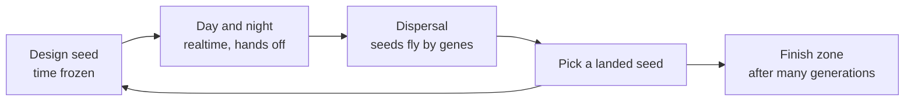

# Bitbloom — Project Bible

2026-09-20 · Milan

## Start here

**Bitbloom — Survival of the Fernest** is a fresh Unity 6.3 LTS project by Milan. This bible is its design and architecture of record; everything in it was decided on 2026-09-20 unless marked open. No code is reused from the older Abracodabra project.

### The three founding files

| File | Location | Role |
| --- | --- | --- |
| `CLAUDE.md` | Unity project root | Auto-loaded operating manual: invariants, code rules, workflow, memory, tools |
| `projectmemory.md` | `ClaudeProjectFiles/01_Core/` | Living state + dated decision log; Claude updates it as work happens |
| `Project_Bible.md` (this) | `ClaudeProjectFiles/01_Core/` | Design and architecture; changes only when a decision changes, logged in projectmemory |

### How to work

- **Code lane — Claude Code**, opened in the project folder, with the Unity MCP bridge connected (see Unity project setup, step 7). All code, tests and Unity checks happen here.
- **Design lane — Cowork or chat**, with the same folder connected. Outputs are `.md` files in `ClaudeProjectFiles/`; the code lane picks them up from there.
- **One source of truth:** the files in the project folder. Don't upload copies into a Claude project's knowledge; they go stale.

**Reading order** for a fresh session: CLAUDE.md → projectmemory.md → the bible sections the task touches. Any code task: **Simulation foundation (v2)** and **Unity project setup** are required.

| Part | Sections |
| --- | --- |
| Design | Pitch · Core loop · Run structure · Living ecosystem · Genes · Seed editor · Day and night · Balance · Traps to avoid |
| Technology | Lessons from Noita · Engine · Chemistry · Simulation foundation · Content authoring · Display math · Plants and creatures |
| Execution | Unity project setup · Weekend PoC · Open questions · Files and first prompt |

## Pitch and pillars

**Bitbloom — Survival of the Fernest: a side-view pixel-simulation roguelite autobattler where you are a plant bloodline.** Each generation you design a seed, watch it grow and fight through a day and night in a living Noita-style world, then ride your own seeds to a new spot. The land you cross decides how you evolve. The name says it: pixels (*bit*) that grow and evolve (*bloom*).

### Pillars

1. **You are a lineage, not a gardener.** One plant per generation; travel happens through reproduction.
2. **Chemistry is the combat.** Plants fight by emitting materials; the world's reactions do the rest.
3. **The environment steers evolution.** Terrain, biome and wild neighbors decide which genes are around and which builds survive.
4. **Watch, don't pilot.** Decisions happen while time is frozen; the day plays itself.
5. **Everything is pixels you can author.** Materials, stamps and generated plants; no imported sprites.

### Known risks

- **Noita's engine took years.** Rigid bodies and huge streamed worlds are out. One simulated area at a time.
- **"Simpler yet more complex" is how scope explodes.** Every material multiplies interactions to tune.
- **Tools can eat the game.** Tools grow only as fast as the game needs them.
- **A second unfinished project.** After the weekend PoC, decide *continue*, *fold ideas back into Abracodabra*, or *shelve*, using the success test, not mood.

Weekend PoC odds (estimate): \~95 % for sim + chemistry + one growing plant; \~60 % for one full generation.

## Core loop: you are a lineage

**One plant per generation. It grows and defends itself through a realtime day and night, then disperses seeds; you continue as one of them.** Side view, realtime, no avatar, no WeGo.



### Everything the player does (the complete list)

1. **Start of run:** pick an archetype (a starting genome). Three at launch.
2. **Design:** edit the new seed's genome with the genes and Vigor you carry.
3. **Start the day.** During it: pause and speed (1× / 2× / 4×) only.
4. **Pick a landed seed** when more than one landed somewhere viable.
5. Repeat until you reach the **finish zone** at the far right of the world, or your lineage dies out.

No other inputs. Avatar, live verbs and placeables stay out until the loop is proven fun.

### Pacing of one generation (\~2.5 min)

| Phase | Length | What happens |
| --- | --- | --- |
| Design | Player's time | Typically under 20 s: 0–2 changes from the parent |
| Sprout | \~10 s | Seed burns its stored Vigor for fast early growth, so there's no dead start |
| Day | \~80 s | Threats ramp: calm morning, afternoon waves, the wild ecosystem moving around you |
| Night | \~45 s | Different creatures, no sunlight, stored energy decides survival |
| Dispersal | \~10–15 s | Seeds fly by your dispersal gene; camera follows |

### Run-level structure

- **Vigor** is the only currency. Energy left at dawn becomes Vigor carried by the seeds (split among them). It is spent in the editor: opening a strand slot, slotting a rare gene, rerolling a mutation.
- **Season clock:** a run has a fixed number of generations before winter (e.g. 20). Staying near a safe spot is allowed, but it costs time. Distance to the finish zone vs. safety is the run-level tension.
- **Finish zone:** a special area at the far right (e.g. a spring or an ancient grove). Reach it = win.
- **Lose:** your plant dies before it seeds, no seed lands anywhere viable, or winter arrives.

Why it works: every generation has a story reason to redesign the seed, the path map becomes physical, and genes have two jobs (survive today, travel well tonight).

## Run structure: travel by seed

**Recommendation: the world runs left to right, with caves beneath. Right is progress, down is risk and reward.** A prevailing east wind makes the direction readable. Seeds that fall into cracks reach the cave layer: no sun, strange chemistry, rare genes.

- **World:** a long strip of screen-sized areas (480 × 270 each), generated lazily from the run seed. Surface band on top, cave band below.
- **Only the current area is simulated.** Areas you leave freeze; areas ahead are generated when a seed lands there.
- **A run:** 3 biomes of \~5 areas each, ending at the finish zone. Seeds may land in the current area (safe, no progress) or 1–2 areas ahead. Example biomes: Meadow → Marsh (water, acid bog) → Ash Fields (heat, fire), each with caves below.

### Dispersal methods (genes)

| Method | Distance | Control | Special |
| --- | --- | --- | --- |
| Wind (fluff, wings) | Far | Low, depends on the day's wind | Taller plant = farther |
| Burst pod | Short | High, readable arc | Can reach ledges; the burst can carry a payload |
| Animal carrier (tasty fruit) | Medium | None, follows the animal | Only way into some hidden groves and caves |
| Water float | Follows streams | Medium | Downhill, often into caves |
| Runner / rhizome | Very short, underground | High | Safe, steady, slow progress |

Seed count is a gene too: more seeds means more options to pick from, but each costs energy you didn't spend on defense.

### The pick

Every landed seed is shown in place with **where** (soil, light, moisture, threats nearby) and **what** (its mutation). Unviable landings (bare stone, deep water) are greyed out. Picking a seed chooses your position, your mutation and your loot at once.

**Loot is in the world, not in a shop:** gene amber in rock, a dead ancient plant to absorb, a symbiotic insect nest. Land next to it and it's yours.

### Risks to guard against

- **Random landings feel unfair.** Always guarantee at least 2 viable landings; show the wind forecast during design; precision genes reduce spread.
- **Too much travel, too little growing.** Dispersal is a 10–15 s show, not a minigame.
- **World size creeps up.** One simulated area at a time is the hard rule.

## Living ecosystem

**The world is alive before you arrive and keeps living around you.** Wild plants and animals use the same systems as the player's plant, so the ecosystem is not decoration — it competes, feeds, threatens and hands out genes. This is where the evolution feel comes from.

### Wild flora

- **Same plant system, wild genomes.** Each biome has 3–5 wild species whose genomes fit it: desert succulents that store water, marsh reeds with deep roots, cave fungi that eat decay.
- **They compete with you** for light and water. A tall wild tree can shade you out; clearing it (with acid or fire) is a real strategy.
- **They are gene sources.** If your plant flowers near a wild plant, **cross-pollination** can pass one of its genes into your seeds. Landing next to the right neighbor is how you pick up genes — no shop.
- **Wild populations drift.** The same species looks and behaves a little differently in each area (visible mutations), so the world feels like it evolves too.

### Fauna: a small food web

| Role | Examples | What they do to you |
| --- | --- | --- |
| Herbivore | Beetles, slugs, caterpillars | Eat leaf pixels; main pressure |
| Predator | Spiders, birds | Eat herbivores: an ally if you don't burn them |
| Pollinator | Bees, moths | Carry pollen: enable cross-pollination, some carry seeds |
| Decomposer | Worms, fungus gnats | Turn dead matter into fertile soil |
| Carrier | Birds, burrowing rodents | Eat fruit and drop seeds far away (animal dispersal) |

- **Resident fauna** live in the area when you land; **arriving fauna** spawn from edges over the day and night, set by the biome's threat budget.
- **Night swaps the cast:** moths drawn to glow, slugs, owls.
- **Friendly fire is on.** Your acid hurts spiders and bees too. Killing pollinators costs you cross-pollination.

### How the environment steers evolution

- Each biome weights which genes appear (in wild plants, gene amber and pollinator loads). Marsh: water and sap genes; Ash Fields: fire-resistant bark and ember genes; caves: fungal and moon energy.
- The terrain rewards traits: dry sand needs deep roots or water storage, dense canopy needs height, open sky rewards sun leaves.
- **So the smart run reads the land ahead** (visible in the dispersal preview) and evolves toward it. Each generated world pushes a different route.

### Limits (performance and readability)

- At most \~30 wild plants and \~60 creatures per area; creatures sleep when off-screen.
- Every creature type has one clear job and one clear silhouette.

## Genes: a plant is a wand

**The strand works like a Noita wand: read left to right, shape genes stick to the next emit, and the world's chemistry does the rest.** This is the buffer model from your deep-dive doc, stripped to four gene kinds. The fun comes from what the emitted materials do in the world, not from long gene lists.

### Plant body = wand stats

| Wand stat (Noita) | Plant equivalent | Set by |
| --- | --- | --- |
| Capacity | Strand length (3–8 slots) | Seed trait, grows with lineage |
| Mana max | Energy storage | Stem thickness trait |
| Mana charge | Energy income = lit leaves × light | Leaf type + where you landed |
| Cast delay | Pulse delay between casts | Trait |
| Recharge | Rest after the strand ends | Trait |

### Four gene kinds

| Kind | What it does | Examples |
| --- | --- | --- |
| **Emit** | Launches a material at the nearest threat; costs energy | Acid Spit, Ember, Water Drop, Spore Puff, Thorn Shard, Sap Glob |
| **Shape** | Changes the next Emit | Heavy (arcs), Split (bursts into 5), Big, Fast, Seeping (leaves a trail) |
| **Chain** | Changes how genes are read | Twin / Triple (fire next 2–3 together), Trigger (next Emit carries the following gene and fires it on impact), Timer (fires it after 1 s) |
| **Trait** | Body slots outside the strand | Root type, leaf type (sun / moon / fungal), dispersal method, seed count |

Growth itself is **automatic from traits**; the strand only decides what the plant *does*. That keeps the strand short and readable.

### Example strands

- `Twin · Heavy · Acid Spit · Ember` — an arcing acid glob and an ember, fired together.
- `Trigger · Water Drop · Spore Puff` — a droplet that bursts into spores where it lands; on wet soil the spores sprout fungus.
- `Seeping · Sap Glob · Ember` — a sticky trail that slows beetles, then set alight.

### Rules that keep it simple

- **About 20 genes at launch.** Depth comes from chemistry combos, not gene count.
- **No stat genes like +10 % damage.** Every gene changes something you can *see*.
- **Idle plants bank energy.** No target, no cast: a quiet morning becomes a big burst at dusk.

### Where genes come from

| Source | How |
| --- | --- |
| Your archetype | Starting genome, 3–4 genes |
| Mutation | Each landed seed carries one small change: reorder, swap a Shape, duplicate, rarely a new gene |
| Cross-pollination | Flower near a wild plant; a pollinator visit can pass one of its genes |
| Gene amber, ancient plants | Found in the world; land next to it to absorb |

Genes go into a **pouch** carried by the lineage. Vigor pays for using rare ones and for extra strand slots.

## Seed editor: small edits, instant feedback

**You never build from scratch: each seed inherits its parent's genome plus one mutation, so a typical edit is 0–2 changes in under 20 seconds.** This carries over the lesson from Abracodabra: how fast you can edit decides the editor design, not how deep the model is.

### One screen, three zones

- **Plant preview (left):** a live silhouette of the grown plant that morphs as traits change (Visual Genome). Trait slots sit around it.
- **Strand (center):** a horizontal wand bar with capacity slots. Chain genes draw their links: a bracket from Twin over the next two Emits, an arrow from a Trigger's carrier to its payload. Noita never shows how a wand is read; we always do.
- **Gene pouch (bottom):** everything you carry, filterable by kind.

### Instant feedback

- **Live test bench:** a small window runs the real simulation with a dummy beetle walking in, your strand firing on loop at 4× speed. Our sim runs headless, so this is almost free.
- **Cast timeline:** "every 2.4 s: acid + ember → rest 3 s".
- **Energy bar:** energy per cycle against income *at the spot this seed landed* (its real light and moisture). Red when the strand can't pay for itself.
- **The mutation glows**, so you see what changed since the parent.

### Input rules

- [ ] Click a pouch gene → first empty slot; click a slot gene → back to pouch.
- [ ] Drag to reorder; drop on a gene to swap.
- [ ] Ctrl+Z undo, unlimited within the edit; number keys pick slots.
- [ ] Hover = one-line tooltip + tiny animated icon.
- [ ] No nested menus, no confirmation dialogs.

Things to decide later: can you reject a mutation, and at what cost? Are genes consumed when slotted, or copied from a library?

## Day and night

**Keep it, but add it after the PoC; design the light system for a moving sun from day one so it slots in without rework.** The sun angle is just a parameter of the light map (see Simulation foundation).

- **Day (\~90 s):** sun moves across the sky, shadows sweep, sun leaves earn energy. Most beetles are active.
- **Night (\~45 s):** no sunlight. Moon leaves earn a trickle; sun leaves earn nothing. Different threats: moths drawn to glowing plants, nocturnal slugs.
- **Storage matters:** a sun build with a thick stem banks the day's energy for a night burst. A moon build is weak by day but owns the night.
- **Glow as a trade-off:** bioluminescent genes light the area (helping neighbors) but attract night creatures.
- **Caves are permanent night.** Seeds that land underground need moon, fungal or chemical energy (drinking from acid pools, heat vents). This is what makes caves a real risk/reward branch, not just a different color.
- **Dispersal happens at dawn**, so the night is the last test before your seeds fly.

## Balance philosophy

**Broken builds are allowed; safe builds are not guaranteed.** Like Noita, a lucky combo can go wild, but the world can still kill you. Balance comes from a few structural limits, not from tuning hundreds of numbers.

### Structural limits

1. **Energy is the universal limiter.** Every Emit costs energy; income is lit leaves × light. A strand that fires too much simply stalls. No gene breaks this rule.
2. **Chemistry balances itself.** An acid monster dissolves its own soil and roots; a fire build burns its own leaves; a water build floods its roots. Power carries its own risk.
3. **Finite reagents.** Every emitted pixel is used up by its reaction (see Chemistry). Damage can't snowball endlessly.
4. **Environment varies the answer.** The same build is great in one biome and weak in the next, so no single build solves every run.
5. **Mutations are small.** One change per seed keeps power growth gradual and readable.

### Keeping numbers manageable

- **Few knobs, one place.** All balance values live in one `BalanceConfig` asset plus the gene and material assets. No magic numbers in code.
- **Designer units.** Times in seconds, rates per second, ratios; the code converts (like the reaction-chance formula).
- **Headless balance lab.** Because the sim runs without a scene, a tool can play 100+ generations with bot choices overnight and report survival per archetype, gene pick rates and average run length. Balance from data, not gut feeling.
- **Tuning order:** chemistry first, then energy economy, then genes, then threat budgets. Later layers must not hide problems in earlier ones.

## Traps to avoid

1. **Runaway chaos.** Fire that eats the whole plot or floods that drown everything make the build irrelevant. Build dampers in from the start: burn-out timers, soil soaks water, reaction caps per chunk.
2. **Randomness that feels unfair.** The player can't react mid-battle, so a loss must be explainable by the build. Keep reactions predictable in aggregate; show a short "what happened" recap after each battle.
3. **Pixel-physics rigid bodies.** Noita's hardest system. Skip entirely.
4. **Creatures made of simulated pixels.** Hard to animate and control. Creatures are *agents* (stamp + code) that read and write the grid.
5. **Big worlds.** Chunking is in from day one, but streaming and endless maps are out. One plot, one screen.
6. **Simulation depth nobody sees.** Temperature, pressure, gas density: skip until a specific interaction needs it.
7. **Tools before game.** The editor tools pay off long-term, but a gorgeous material browser with no fun battle is the classic trap. Tools grow only as fast as the game needs them.

## Lessons from Noita

**Copy Noita's data model and its update tricks; skip its physics and its world size.** Details come from the developers' GDC 2019 talk and the modding docs ([GDC Vault](https://www.gdcvault.com/play/1025695/Exploring-the-Tech-and-Design), [80.lv summary](https://80.lv/articles/noita-a-game-based-on-falling-sand-simulation), [Reaction docs](https://noita.wiki.gg/wiki/Documentation:_Reaction)).

| Noita feature | What it does | For us |
| --- | --- | --- |
| 64 × 64 chunks with a dirty rect each | Only pixels that changed recently get simulated | **Copy from day one.** Cheapest big performance win, and the reason the sim can grow without a rewrite |
| Bottom-up update order | Falling things move a full step per frame | **Copy** (plus alternating left/right scan) |
| Checkerboard multithreading, 4 passes | Chunks updated in parallel without locks; a pixel may move 32 px beyond its chunk | **Design for it, turn on later.** Our plots are small enough for one thread at first |
| Materials defined as data, with **reactions**: input A + input B → output C + D at a probability, grouped by tags like `[fire]`, `[water]` | New interactions without new code | **Copy — this is the heart of "easy to edit"** |
| Rigid bodies (pixels belong to a Box2D body, re-shaped by marching squares) | Falling rocks, breaking objects | **Avoid.** Hardest system in the game |
| Free particles (flying pixels that land back into the grid) | Splashes, sparks, explosions | **Copy, simplified** — big juice for little code |
| Huge streamed world, Wang-tile level gen | Endless exploration | **Avoid the streaming.** Borrow the idea of hand-made pieces + 50 % randomization for plots |

Design lessons worth keeping in mind:

- **Noita is chaos you survive; we are chaos you plan for.** Players can't react mid-battle, so outcomes must feel *earned by the build*, not random. Keep reaction probabilities high enough to be predictable in aggregate.
- **Readability.** Noita kills players with things they didn't see. Every dangerous material needs a distinct color, motion and glow.
- **Runaway reactions** (fire spreading through everything) need global dampers: burn-out timers, reaction budgets per chunk per frame.

## Engine decision: Unity, used thinly

**Use Unity 6.3 LTS, but build our own systems and use Unity only as a window, a texture uploader, input, and an editor-tool host.** Your worry about fighting built-ins is right — the answer is to not depend on them, not to switch engines.

Why not Godot:

- **Speed.** A per-pixel sim is too slow in GDScript. In Godot you'd need C# (no Burst equivalent) or C++ GDExtension (a big new skill). Unity's **Burst + Jobs** give 10–50× on exactly this kind of loop, plus the thread-safe path to Noita's checkerboard.
- **Cost of switching.** A new engine eats the weekend and your Unity/C# fluency. The PoC would test Godot, not the idea.
- **Web builds.** Godot's C# still can't export to web (not in 4.6; expected 4.7–4.8 at earliest, [forum](https://forum.godotengine.org/t/is-there-an-update-on-exporting-c-projects-to-web/128821)). Unity can build for web, though Burst likely won't speed up the browser version, so a web demo would need a smaller area or lower speed. Verify before promising one.
- **Editor tools.** Both engines allow custom editor windows; Unity's (EditorWindow, UI Toolkit, ScriptableObjects that live-update in play mode) are ones you already know.

Godot's real upsides (small, fast to open, open source) don't outweigh these for this project.

### The "thin Unity" rule

**Version:** Unity **6.3 LTS** (supported to December 2027) rather than the newer 6.5/6.6 updates: stability matters more than new features for a solo project. Unity 7 is planned without breaking changes, so upgrading later is cheap ([version overview](https://makaka.org/unity-tutorials/best-version)).

**The core is plain C#.** `Sim.Core` is an assembly with *no Unity engine references at all*: kernels, reactions, organisms and gene execution are static C# working on unsafe pointers to the cell array. A thin Unity assembly wraps them in Burst jobs (Burst compiles the whole call chain, including code from other assemblies). Two payoffs:

- **Claude can compile and test the sim outside Unity** with a small `dotnet test` project next to the Unity project. Rules get verified before you press Play, which cuts the "paste console errors back" loop.
- **Portability.** If we ever switch engines, the core moves as-is.

The cost: raw pointers skip Unity's safety checks, so the core gets its own bounds checks compiled in for debug builds only. Core code stays within C# 9 (Unity's language version).

| Unity feature | Use it? | Instead |
| --- | --- | --- |
| Texture2D + one quad/sprite, point filtering | Yes | — |
| Camera (orthographic) | Yes, as a dumb blitter | Our own integer-scale math (see display section) |
| Pixel Perfect Camera component | **No** | Our own math; it hides the numbers you want to control |
| Tilemap, Physics2D, Rigidbody, Animator, SpriteRenderer per entity | **No** | Grid, our own collision against the grid, code-driven animation |
| Burst, Jobs, NativeArray, Mathematics | Yes | — |
| Input System | Yes | — |
| ScriptableObjects + custom EditorWindows | Yes — the content toolchain | — |
| UI Toolkit | For editor tools and later menus | Debug overlay drawn in-texture for the PoC |
| URP 2D + Bloom | Yes, minimal | — |

## Chemistry and terrain safety

**Rule: chemistry transforms, it almost never deletes.** Every reaction that destroys ground leaves a residue that can become ground again. That's the conservative-Noita line: rich mixing, but the plant always has somewhere to grow.

### Safety mechanisms

1. **Resilience tiers.** Bedrock (indestructible, forms the area's frame) → Stone (only slow, strong reactions) → Soil / Sand (reacts freely). No reaction may target bedrock.
2. **Reagents are used up.** One acid pixel dissolves at most one or two pixels, then turns to spent sludge. Damage is always finite, as in Noita.
3. **Residue returns to ground.** Dissolved soil → mud → settles back to soil. Burned plant → ash → fertile soil. Glass from sand + fire is solid ground too.
4. **Roots bind soil.** Soil touching a root doesn't fall or dissolve easily. Plants literally hold the world together — a nice synergy, not just a rule.
5. **Budgets.** Reactions per chunk per step are capped; fire needs fuel and burns out; explosions have a hard radius.
6. **Measured, not hoped.** A headless soak test runs 10 minutes of worst-case chaos and checks that at least 70 % of plantable soil survives. Tune until it passes.

### Starter reaction set (about 12)

| Inputs | Result | Why it's fun |
| --- | --- | --- |
| Water + Soil | Wet soil (moisture) | Feeds roots; water disappears into the ground |
| Fire + Plant / Sap | Fire + Ash | Fire needs fuel; ash is fertilizer |
| Ash + Wet soil | Fertile soil | Loss becomes growth |
| Water + Fire | Steam | Mist plants are firefighters |
| Steam (cools) | Water drops | Local rain after a fire |
| Acid + Soil | Mud + spent acid | Digs, but finite and recoverable |
| Acid + Water | Weak acid | Water is the counter to acid |
| Acid + Beetle | Damage | Main attack |
| Sap + Beetle | Slowed | Sticky control |
| Spores + Wet dead plant | Fungus | Spreads on corpses; cave energy source |
| Ember + Spore cloud | Flash burst | Dangerous combo, short range |
| Sand + Fire (sustained) | Glass | Makes ground, doesn't eat it |

## Simulation foundation (v2)

**A Burst-compiled cellular automaton over one flat "active window", with 8-byte packed cells, stateless hash randomness, per-chunk dirty rects, and coarse low-resolution fields for slow things like light.** Plants and creatures talk to the grid only through queues. Every choice below is picked so that growing the game adds data or turns on a switch, never forces a rewrite.

**Change from v1:** Burst from day one instead of "plain C# first". Burst-ready code costs the same to write if designed in; retrofitting it later is exactly the rework we want to avoid. You can still debug normally by switching Burst compilation off in the editor.

### Three levels of storage

| Level | What | Size |
| --- | --- | --- |
| **Chunk store** | The whole run's world as 64 × 64 chunks. Generated lazily from the seed; compressed (run-length) once frozen | Grows with the journey |
| **Active window** | The current area plus a 64 px margin, as one flat array. The only thing the hot loop ever sees | 640 × 384 = 10 × 6 chunks, 245,760 cells |
| **Coarse fields** | Light, wind, later heat, at 1/4 resolution, sampled smoothly | 160 × 96 |

Moving to a new area pages chunks out of the window into the store and new ones in. The hot loop stays a simple `x + y * width` array no matter how long the journey gets.

### The cell: 8 bytes that move together

| Field | Bytes | Meaning |
| --- | --- | --- |
| `material` | 2 | Material id (up to 65k) |
| `life` | 1 | Age, burn timer, decay |
| `flags` | 1 | Step-parity bit, owned bit, free bits |
| `aux` | 1 | Depends on kernel: moisture (soil), fall speed (powder, liquid), charge (fire) |
| `shade` | 1 | Color variant, fixed when the pixel is created |
| `owner` | 2 | Plant or creature id, 0 = none |

**Why packed, not separate arrays:** a moving pixel carries its moisture, age and color with it. Moving it is one 8-byte swap instead of six. The whole window is \~1.9 MB and fits in CPU cache.

### Materials and reactions as baked tables

Material assets are baked at load (and on every edit in play mode) into flat, Burst-readable tables: kernel, density, spread, flammability, resilience tier, opacity, color-table offset. Reactions become an N × N lookup table indexed by material pair, pointing into a reaction list. No `if` chains in the hot loop.

### One step (fixed 60 Hz)


Plant and creature writes from the last step are applied first, so nothing changes under the sim mid-step. Organisms then react to what happened (leaf eaten, stem burned) from a queue instead of scanning their bodies.

**Movement rules**

- Rows bottom to top; each row's left/right direction comes from a random bit. Cells whose parity bit matches this step already moved and are skipped.
- **Powder:** down, else a random diagonal; sinks through lighter liquids.
- **Liquid:** down, diagonal, then slides sideways up to *spread* cells in one step, which is what makes water level out quickly.
- **Gas:** inverted liquid, plus random drift and a lifetime.
- **Falling speed:** falling powder and liquid pixels speed up by 1 each step, up to 8 cells per step, checking the path. Gives weight and splashes. The cap of 8 also keeps multithreading possible later.

**Reactions:** each awake cell checks **one random neighbor** per step, looks up the pair, and rolls the chance. Designers enter a *mean reaction time* T in seconds; the per-check chance is derived:

```latex
p = 1 - e^{-\frac{k}{T \cdot f}}
```

with f = 60 steps per second and k = 8 neighbors (a given neighbor is checked 1 time in 8). So "acid eats soil in about 0.5 s" is typed as 0.5, not as a magic percentage.

**Dirty rects:** every write grows that chunk's next-step rectangle (and its neighbor's, on a border). A chunk with an empty rectangle sleeps and costs nothing. **Slow processes must not keep chunks awake:** moisture spreading and drying run in a separate slow pass touching 1/16 of the cells each step.

### Randomness: stateless hash

`r = hash(x, y, step, runSeed)`, a small integer hash such as PCG or Squirrel3. There is no RNG state, so results don't depend on update order, and threads never share anything. Same seed + same inputs = same world on the same build.

### Free particles

Projectiles, splashes and seeds in flight are particles with float position and velocity, pushed by gravity and the wind field. Each step they trace through the grid (DDA line walk); on a hit they either settle into the nearest empty cell or fire their payload. Capped at a few thousand, updated in their own Burst job.

### Light (built ready for day and night)

- **Sun:** for sun angle θ, sweep the coarse light field from the top row down. Each row takes light from the row above, shifted by tan θ, times the transmittance of the cells in between. \~15k operations, every 4 steps.
- **Glowing materials** (fire, acid, glowing plants) add light that spreads for 2–3 blur passes, blocked by opaque cells.
- **Render:** a shader multiplies crisp point-sampled pixel colors by the smoothly sampled light field and adds glow for bloom. Pixels stay sharp while the light stays soft.

### Rendering

Colors come from a precomputed table per (material, shade), built from the palette. Only dirty chunks are repainted into the display buffer, then one texture upload per frame. The texture is created in code as RGBA32, sRGB (not linear), point filter, clamp, no mipmaps, so palette colors show exactly as authored in a Linear-color-space project. Creatures and particles are painted into the buffer after the sim; they are never simulated as material pixels.

### Frame budget (estimates to verify in the PoC)

| Work, 640 × 384 window | Estimate |
| --- | --- |
| Move + react, everything awake (Burst, \~5 ns per cell) | 1–2 ms |
| Same, typical (\~30 % awake) | \~0.5 ms |
| Particles (4,000) | < 0.2 ms |
| Light field | < 0.1 ms |
| Texture upload (\~1 MB) | 0.3–0.5 ms |
| **Target for the whole sim** | **< 4 ms of the 16.6 ms frame** |

The debug overlay shows these live. If the worst case goes over budget: first more sleeping chunks, then Noita's 4-pass checkerboard threading. The fall-speed cap and stateless randomness keep that switch safe.

**Fast-forward multiplies the cost.** At 4× speed the sim runs 4 steps per frame, so a 3 ms step becomes 12 ms. Rules: keep the worst-case step under \~3 ms; the renderer repaints once per frame, not once per step; if 4× still drops frames, it quietly degrades to fewer frames per second rather than slowing the sim.

### Tests that guard it

- **Rule tests:** sand piles, water levels within N steps, one acid pixel dissolves at most 2 pixels.
- **Soak test:** 10 minutes of worst-case chaos, at least 70 % of plantable soil survives.
- **Speed test:** step time under budget on a full-fire scene.

### Extension points

| To add… | You touch… |
| --- | --- |
| A material or reaction | Assets only |
| A new cell property | A free flag bit or `aux` meaning; a coarse field if it is smooth (heat) |
| A new movement type | One new kernel |
| A plant gene or creature | Gene/creature asset; code only for a new behavior |
| A longer journey | Nothing: the chunk store grows |
| More speed | Checkerboard threading switch |

## Content authoring: paint with materials, not sprites

**Everything in the world is authored as material pixels inside Unity; nothing is imported as a sprite.** Colors come from materials and one palette, so art stays consistent and recoloring the game is one edit.

### The four tools

| Tool | What you do in it | Saved as |
| --- | --- | --- |
| **Material Browser** (editor window) | Searchable list of every material with a live swatch, filter by kernel or tag, edit properties inline, and a **mini sandbox** in the window where you drop a blob and watch it behave. A second tab shows the **reaction matrix** (material × material); click a cell to add or edit a reaction | One `MaterialDef` asset per material + reaction assets |
| **Stamp Painter** (editor window) | Draw on a pixel grid with materials as your brushes: pencil, fill, line, rectangle, mirror, eraser. An extra *marker* layer holds points like spawn, anchor, Heart Plant socket | `PixelStamp` asset |
| **Plot Generator** | A stack of steps: noise terrain → caves → water pools → place stamps by rule → scatter. Seed field + Regenerate button with live preview. Steps reorder in the inspector | `PlotRecipe` asset |
| **Play-mode dev brush** | Paint any material or stamp into the running sim; select a region and **save it as a stamp** | `PixelStamp` asset |

The dev brush is the fastest path: build a scene in-game, watch it react, capture the good part.

### What gets generated instead of drawn

- **Plants:** fully grown by code from their genome. Zero art assets.
- **Creatures:** a few small stamps (body frames) + code-driven motion (leg pixels shift, body bobs). Later possibly generated from parameters (length, legs, color).
- **Plots:** recipe + seed. Hand-painted stamps give the handmade feel.
- **Color:** each material has a color ramp; per-pixel noise picks a shade. A global `Palette` asset holds the moss-and-sage base.

### Rules for the toolchain

- **Stable string keys** (`"water"`, `"soil_fertile"`) in assets; numeric ids assigned at bake. Reordering or deleting a material never corrupts saved stamps.
- **Live edit:** changing a material asset in play mode re-bakes instantly, so you tune fire while it burns.
- **One asset per material**, not one giant list: easy to duplicate, easy to diff in git.
- **Optional PNG import** later: map image colors to the nearest palette material, for anyone who prefers Aseprite.

## Pixel-perfect display math

**Rule: a sim pixel is always exactly s × s screen pixels, with s a whole number. The screen never shows black bars and never blurs; spare space shows more backdrop world instead.** No Pixel Perfect Camera, no scaling by Unity — we compute it.

### The formulas

With screen size W × H and plot size P\_w × P\_h (480 × 270):

```latex
s = \max\left(1,\ \left\lfloor \min\left(\frac{W}{P_w},\ \frac{H}{P_h}\right) \right\rfloor + z\right)
```

```latex
V_w = \left\lceil \frac{W}{s} \right\rceil,\quad V_h = \left\lceil \frac{H}{s} \right\rceil
```

- *s* = integer scale; *z* = zoom steps chosen by the player (0 = whole plot fits).
- *V\_w × V\_h* = the virtual view in sim pixels: the plot plus generated backdrop around it (bedrock, sky, roots).
- The view is drawn at *V × s* screen pixels, centered; the overflow (under *s* pixels per edge) is cropped.
- Mouse to sim pixel: `x = floor((mouseX - drawOriginX) / s)`, same for y.

### Render path

1. The sim, backdrop, creature stamps and particles are all composed **on the CPU into one Color32 buffer of V\_w × V\_h**.
2. That buffer is uploaded to one texture (Point filter, no mipmaps, no compression).
3. One screen-space draw at integer scale *s*. Bloom runs after that, on the full-resolution image.
4. UI is drawn separately at native resolution (or, later, a pixel font into the buffer).

Camera panning when zoomed moves in whole *screen* pixels, so scrolling stays smooth without ever resampling sim pixels.

### Worked examples

| Screen | s | Virtual view (sim px) | What you see |
| --- | --- | --- | --- |
| 1920 × 1080 | 4 | 480 × 270 | Exactly the plot |
| 3840 × 2160 | 8 | 480 × 270 | Exactly the plot |
| 2560 × 1440 | 5 | 512 × 288 | Plot + thin backdrop frame |
| 2560 × 1080 (ultrawide) | 4 | 640 × 270 | Plot + backdrop left and right |
| 1280 × 800 (Steam Deck) | 2 | 640 × 400 | Plot + wide backdrop; zoom +1 fills, crops plot edges slightly |
| 1280 × 720 | 2 | 640 × 360 | Same; zoom +1 crops the plot edges slightly |

480 × 270 is chosen because it divides 1080p and 4K exactly. All numbers live in one `DisplaySettings` asset, so changing plot size or zoom is one edit, and a debug overlay prints s, V and the draw rect live.

## Plants and creatures

**Side view, like Noita.** Gravity, roots below ground and light from the sky only make sense side-on. (Decided 2026-09-20.)

### The plant

A `Plant` object owns a genome, an energy pool and a list of its pixels. Each organism tick it:

1. **Reads its events** — the sim queues every lost pixel it owns (eaten, burned, dissolved). Leaves lost = energy lost. No body scanning.
2. **Gathers light** — each leaf samples the coarse light field (sun by day, moon or glow at night).
3. **Drinks** — root tips pull moisture from adjacent soil pixels. Water soaks into soil; soil dries slowly.
4. **Grows** — automatic from traits: root toward moisture, stem toward light, leaves, fruit. Queued as writes for the next step.
5. **Casts** — runs its strand like a wand when a threat is in range and energy allows.
6. **Disperses** — at dawn, fruit releases seeds as flying particles by its dispersal gene.

Pixel types: `Seed`, `Root`, `Stem`, `Leaf`, `Fruit`, `DeadPlant` (dry, very flammable, decays to soil).

**PoC genomes:** two trait sets + hand-written strands in assets, no editor UI yet.

| Plant | Traits | Strand |
| --- | --- | --- |
| **Spitter Reed** | Tall, thin, deep roots, wind dispersal | `Heavy · Acid Spit` |
| **Mist Bush** | Low, wide, leafy, burst-pod dispersal | `Twin · Water Drop · Sap Glob` |

### The creatures

**Beetles** arrive from the plot edges in 2–3 small waves: 3 × 2 agents drawn as stamps over the grid.

- Walk on solid surfaces, fall if nothing below, climb one-pixel steps.
- Head for your plant, eating any leaf pixel they touch on the way.
- Take damage from acid and fire; drown in deep water.
- Leave droppings: a fertile pixel. Losses fertilize the soil.

### Interaction sketch

| Material | Moves as | Key interactions |
| --- | --- | --- |
| Stone | Static | Blocks everything; opaque |
| Soil | Powder (steep pile) | Absorbs water into moisture; roots grow only here |
| Sand | Powder | Drains water, holds no moisture |
| Water | Liquid | Soaks into soil; puts out fire → steam |
| Acid | Liquid | Dissolves soil and creatures; water dilutes it away |
| Fire | Energy, short-lived | Ignites flammable neighbors by chance; dies to smoke |
| Smoke / Steam | Gas | Rise and fade |
| Ash | Powder | Mixed into soil = fertile soil (growth bonus) |
| Plant pixels | Owned | Burn; eaten by beetles; dead plant decays to soil |

## Unity project setup

**About 30 minutes, done once, before the first line of code.** Each step names the exact menu. Done when: the empty Boot scene plays, Burst is enabled, one EditMode test passes, and Claude Code can read the Unity console.

### 1. Install and create

- [ ] Unity Hub → Installs → Install Editor → **Unity 6.3 LTS** (newest 6000.3.x). Modules: Windows Build Support (IL2CPP); Web Build Support optional.
- [ ] Hub → Projects → New project → template **Universal 2D**. Name `Bitbloom`, location `D:\Unity Projects\`.
- [ ] Edit → Preferences → External Tools → your IDE (Rider).
- [ ] Install **Claude Code** (desktop app Code tab or terminal) and log in with your Claude account, so it runs on your normal plan usage.
- [ ] Install **Python 3.10+** and **uv** (needed by the Unity MCP bridge in step 7).
- [ ] Optional for Claude's Core tests: **.NET SDK 8** (`dotnet --version` in a terminal).

### 2. Packages (Window → Package Manager)

- [ ] Install **Burst** and **Collections** (Mathematics comes with them).
- [ ] Confirm **Input System** and **Test Framework** are present.
- [ ] Remove **Visual Scripting** and **Multiplayer Center**. Leave the 2D packages that came with the template.

### 3. Project settings

| Where | Setting | Why |
| --- | --- | --- |
| Player → Other Settings | Color Space = **Linear** | Correct lighting math; our texture is flagged sRGB so colors stay exact |
| Player → Other Settings | Active Input Handling = **Input System Package (New)** | No legacy `Input.*` |
| Player → Other Settings | Api Compatibility = **.NET Standard 2.1** | Default; keep it |
| Editor → Enter Play Mode Settings | **Do not reload Domain or Scene** | Near-instant Play. Requires the no-mutable-statics rule |
| Quality | VSync = Every V Blank, Anti Aliasing = Disabled | Pixel art must not be smoothed |
| URP asset (Assets/Settings) | HDR on, MSAA off, Render Scale 1 | Bloom needs HDR; MSAA blurs pixels |
| Physics 2D and Physics | Simulation Mode = **Script** | We don't use Unity physics; no hidden cost |
| Jobs → Burst (top menu) | Enable Compilation ✓, Safety Checks On, Synchronous Compilation ✓ | Measure real Burst speed from the first Play |
| Editor | Asset Serialization = Force Text, Visible Meta Files | Git-friendly (defaults) |

Time settings stay default: the sim runs its own fixed 60 Hz accumulator in `Update`, not `FixedUpdate`.

### 4. Folders and assemblies

| Path | Assembly | Rules |
| --- | --- | --- |
| `Assets/_Project/Code/Core/` | `Sim.Core` | **No Engine References ✓**, Allow unsafe ✓. Cells, material tables, kernels, reactions, particles, organisms, genes, run state. Plain C# 9 |
| `Assets/_Project/Code/Unity/` | `Sim.Unity` | Refs Core, Burst, Collections, Mathematics, Input System; unsafe ✓. GameRoot, Burst job wrappers, renderer, input, UI, ScriptableObject authoring + bake |
| `Assets/_Project/Code/Editor/` | `Sim.Editor` | Editor only. Material Browser, Stamp Painter, dev tools |
| `Assets/_Project/Code/Tests/` | `Sim.Tests` | EditMode tests against Core |
| `Assets/_Project/Data/` | — | Materials, Reactions, Genes, Creatures, Stamps, Config (GameConfig, BalanceConfig, DisplaySettings, Palette) |
| `Assets/_Project/Scenes/Boot.unity` | — | The only scene |
| `Assets/_Project/Shaders/`, `UI/` | — | Pixel composite shader; UI Toolkit files |
| `Tools/CoreTests/` (outside Assets) | dotnet project | Links the Core source files; `dotnet test` without Unity |

**Authoring vs runtime:** ScriptableObjects live in `Sim.Unity` and are *baked* into plain Core structs at load. Core never sees a ScriptableObject.

### 5. Scene

- [ ] `Boot.unity` holds exactly two things: a **Camera** (orthographic, Post Processing on, a Global Volume with Bloom) and a **GameRoot** object whose only Inspector field is the `GameConfig` asset.
- [ ] Everything else is created in code by GameRoot.

### 6. Git and Claude

- [ ] GitHub Desktop → New repository in the project folder, Unity `.gitignore`, plus `Tools/**/bin/` and `Tools/**/obj/`.
- [ ] Copy `CLAUDE.md` into the project root and `projectmemory.md` + `Project_Bible.md` into `ClaudeProjectFiles/01_Core/`.
- [ ] Commit everything before any code. After that: commit after every working build-order block.

### 7. Unity MCP bridge (CoplayDev, free)

Lets Claude Code read the Unity console, run tests and enter Play mode itself, so you stop pasting errors. It runs on your normal plan usage.

- [ ] Window → Package Manager → **+** → *Add package from git URL*: `https://github.com/CoplayDev/unity-mcp.git?path=/MCPForUnity#v10.0.0` (pinned release, not `#main`).
- [ ] Window → **MCP for Unity** → **Configure All Detected Clients** (Claude Code must already be installed).
- [ ] In Claude Code, opened in the project folder: "Read the Unity console." Done when it answers with the console contents.
- [ ] Time-box it to 30 minutes. If it fights you, skip it; everything works without it, with you pasting errors instead.

Rules: commit before letting it edit scenes; ask it for errors and warnings only, not full logs; it works only from Claude Code on your PC, not from cloud sessions. ([CoplayDev/unity-mcp](https://github.com/CoplayDev/unity-mcp))

## Weekend PoC scope

**Goal: one generation that makes you want another.** Grow, survive a day, disperse, pick a seed, land in a second area. Build in this order; each block leaves something working, so stopping early still teaches you something.

### Build order

- [ ] **Sat AM — Foundation:** project set up per *Unity project setup*, `Sim.Core` + `Sim.Unity` assemblies, active window + dirty chunks, 8-byte cells, material assets + bake, Powder/Liquid/Static kernels in one Burst job, display math, dev brush. Done when: sand piles, water levels out, 60 fps, crisp while resizing the window, and the first `dotnet test` passes.
- [ ] **Sat PM — Chemistry:** Soil moisture, Fire, Smoke, Steam, Ash, Acid, Sap; reactions as data with mean-time input; resilience tiers. Done when: a new reaction added in an asset works with no code change, and acid can't dig forever.
- [ ] **Sat eve — First plant:** Mist Bush grows from seed using light and water; event queue for lost pixels. Done when: a seed on wet soil grows, one on dry sand doesn't, and an eaten leaf lowers its energy.
- [ ] **Sun AM — Wand + threats:** strand executor (Emit, Shape, Twin), particles for shots, beetles from the edges. Done when: `Heavy · Acid Spit` visibly arcs, hits and dissolves a beetle.
- [ ] **Sun PM — One generation:** day timer, dawn dispersal (seeds as particles, wind or burst pod), landed seeds highlighted, click one → camera pages to the second painted area and a new seed starts there. Done when: you play three generations in a row.
- [ ] **Sun eve — Juice + capture:** items from the juice list, then record a GIF.

### Controls

Between generations: click a landed seed; Enter = start the day. During the day: Space = pause, Tab = speed. Dev: F1 = dev brush (1–9 materials, wheel = size, S = save region as stamp), F2 = debug overlay (fps, sim ms, awake chunks outlined, particle count), R = restart generation with the same seed.

### Tools this weekend vs later

- **This weekend:** material assets edited in the plain Inspector, the dev brush, save-region-as-stamp, debug overlay.
- **Week after, if continuing:** Material Browser window with mini sandbox and reaction matrix, Stamp Painter window, Plot Generator.

### Juice list (in priority order)

1. Per-pixel color noise on every material (biggest look win for least effort).
2. New plant pixels flash bright for a few frames when they grow.
3. Fire flicker + bloom; acid glows.
4. Free-flying particle pixels for acid shots, splashes and sparks.
5. Water shaded darker by depth; wet soil visibly darker.
6. Beetle hit flash + a small pixel burst on death.
7. Short slow-motion on win or lose.

### Cut list (not this weekend)

Seed editor UI (strands edited in assets) · mutations · night and moving sun (static noon light) · caves · animal and water dispersal · world generation (two hand-painted areas) · editor windows · threading · save/load · audio · menus · more than one creature type · archetype pick (start as Mist Bush) · wild flora, predators and pollinators · Vigor and the season clock.

### Success test (Sunday night)

- Did a battle surprise you in a way that was still explainable?
- After losing, could you tell *why* from what you saw?
- Did you immediately want to replant differently and try again?

Two of three = continue to the next documents. Fewer = fold the best ideas back into Abracodabra.

## Open questions and things to consider

### Decided (2026-09-20)

- Name: Bitbloom — Survival of the Fernest · Side view · realtime · no avatar, no WeGo · Unity 6, used thinly · fresh project, no old code · you are a lineage that travels by seed · wand-style genes · conservative chemistry · day/night later.

### Decide before the weekend

- [ ] **Area size:** 480 × 270 recommended (exact at 1080p and 4K).
- [ ] **Palette:** moss-and-sage greens, warm accents only for fire, acid and fruit?
- [ ] **Day length for the PoC:** 60 s or 90 s?

### Verify during the PoC

- [ ] Does plant growth read clearly at 1 pixel per cell, or do plants need 2 × 2 cells?
- [ ] Does the Burst sim stay under 4 ms with fire and acid everywhere?
- [ ] Do days feel *decided by the build*, or random?
- [ ] Is watching enough, or does the day need one mid-fight decision?
- [ ] Is dispersal exciting to watch, and is the pick a real decision?

### Investigate after the PoC

- **One plant or a colony?** A lone plant is clear and personal; a few side-shoots add tactics. Test both.
- **Rightward only, or also down into caves** from the start?
- **Mutations:** always accepted, or rejectable at a cost? Good, neutral or risky?
- **Genes as items:** consumed when slotted, or a growing library?
- **Enemy variety** as material problems: a burrower that tunnels, a fire beetle, a swimmer, night moths.
- **The recap:** how to show *why* a day went the way it did.

### Things to consider

- **Emergence needs readability.** Every interaction should have a visible cause (a spark, a color change, a puff).
- **Dampers first, drama second.** Tune fire and acid to be controllable before making them spectacular.
- **Keep the sim headless-testable.** Claude can then test reaction rules without you pressing Play.
- **Don't port old code.** Re-derive from the design rules; copying `PlantGrowth.cs` drags in GameObject-per-cell assumptions.
- **Protect Abracodabra.** Commit and push the old project before starting. Nothing in the new project touches it.

## Files and first prompt

**Start with three files; add folders only when something needs a home.**

```
Bitbloom/                         (Unity project root = workspace root)
├─ CLAUDE.md
├─ ClaudeProjectFiles/
│  ├─ 01_Core/
│  │  ├─ projectmemory.md
│  │  ├─ Project_Bible.md
│  │  └─ Codebase_Map.md          (Claude creates it with the first code)
│  ├─ 02_Design/                  (design docs, concept notes)
│  ├─ 03_Tasks/Active | Done      (task packs YYYY-MM_Name.md) + Roadmap.md
│  └─ 99_Archive/                 (superseded docs; never delete)
├─ Assets/_Project/ …
└─ Tools/CoreTests/ …
```

### First prompt

After *Unity project setup*, open **Claude Code in the Bitbloom folder** and send this:

```
Read CLAUDE.md, ClaudeProjectFiles/01_Core/projectmemory.md and ClaudeProjectFiles/01_Core/Project_Bible.md (at minimum: Start here, Core loop, Simulation foundation (v2), Unity project setup, Weekend PoC).

Then, in order:
1. Audit the project against the bible's Unity project setup: Packages/manifest.json, ProjectSettings (color space, input handling, Enter Play Mode options, Burst), folders and asmdefs. Create any missing folders and .asmdef files yourself. List every step I must still do by hand in the Editor, with exact menu paths.
2. Test the Unity MCP bridge by reading the Unity console. If it isn't connected, give me the fix steps and continue without it.
3. Write ClaudeProjectFiles/03_Tasks/Active/2026-09_PoC_Block1_Foundation.md: the "Sat AM - Foundation" block split into small ordered steps, each with Done when + How to check, plus a cut list.
4. Create the ClaudeProjectFiles/01_Core/Codebase_Map.md skeleton and update projectmemory.md.

Don't write game code yet. Stop after step 4 and wait for my OK on the task pack.
```

**Next action:** do *Unity project setup*, copy the three files in, commit, and send the first prompt.
