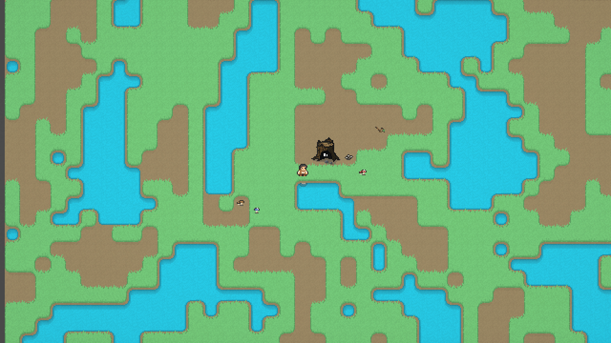
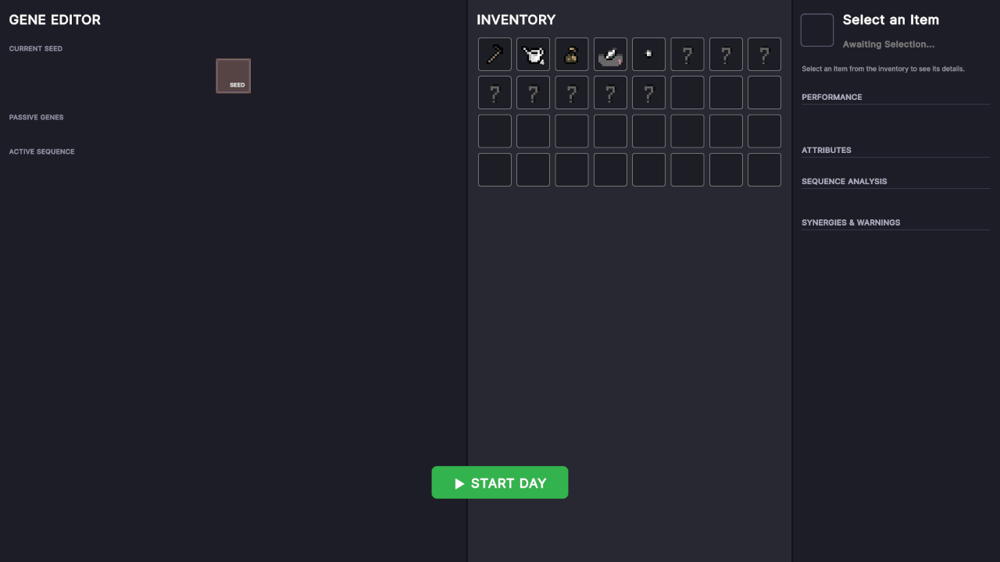
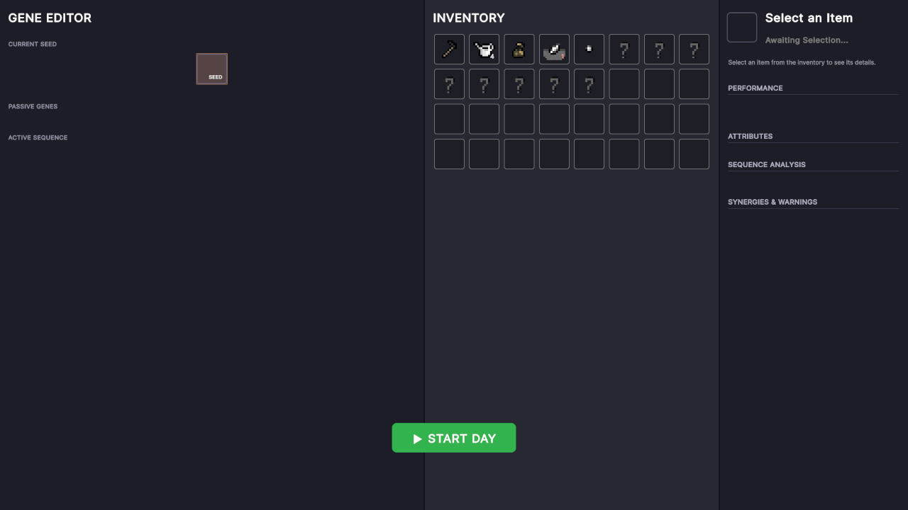

# Unity 6000.0.39f1 → 6000.3.24f1 upgrade

2026-10-05, branch `upgrade/unity-6.3`, tag `pre-unity-6.3` marks main before the upgrade. Done through the Unity CLI (`com.unity.pipeline` 0.8.0-exp.1). Baseline: [`2026-10_Baseline_6.0/`](2026-10_Baseline_6.0/README.md). Point-in-time document: not edited after Phase E closes.

## Result

| | Before (6000.0.39f1) | After (6000.3.24f1) |
| --- | --- | --- |
| Console after the reimport | 0 errors, 0 warnings | **5 errors, 13 warnings** (fixed below) |
| Console after the fixes, 10 s of play | 0 errors, 1 warning | **0 errors, 1 warning** (the same `GeneLibraryLoader` order warning) |
| Camera capture (world: dual grid, water, Doris, gardener) | `game_view_camera.png` | `game_view_camera_after.png`: no pixel differs by more than 4/255 from the baseline |
| Screen capture (Planning UI) | `game_view_screen.png` | `game_view_screen_after.png`: layout and colours identical; 0.3% of pixels (text glyph edges) differ by sub-pixel anti-aliasing, max 97/255 on glyph edges |

| Before | After |
| --- | --- |
|  |  |
|  |  |

## Every error and warning, and its fix

| # | Console message | Cause | Fix (commit) |
| --- | --- | --- | --- |
| 1 | error: `Method 'ResetStaticData' is in a generic class, but [RuntimeInitializeOnLoad] methods cannot be in generic classes` | `SingletonMonoBehaviour<T>` carried the attribute; 6.0 ignored it silently, so with Domain Reload off the quit flag was never reset | The flag moved to a non-generic `SingletonQuitState` (same file) that owns the flag and the reset. The flag is now process-wide instead of per singleton type, which is what an application quit means. 79 → 85 lines. `bbad22d` |
| 2 | error ×2: `Shader error in '…/Sprite-Lit-Advanced_TopDownReflection'` and `'…/Sprite-Lit-Overlay'`: `redefinition of 'FragmentOutput'` and `redefinition of '_ShapeLightTexture0'` | The two custom 2D shaders are copies of URP 17.0's Sprite-Lit-Default: they `#include` `LightingUtility.hlsl` and declare `SHAPE_LIGHT(n)` by hand. In 17.3 `CombinedShapeLightShared.hlsl` includes `LightingUtility.hlsl` itself (no include guard), so everything was declared twice | Removed the manual include and the `SHAPE_LIGHT(0..3)` blocks from the Universal2D pass of both shaders (`Assets/Shaders/Sprite-Lit-Default_OverlayAdvanced.shader`, `…_OverlayCustom.shader`). `19029ee` |
| 3 | error ×2, shown after #2: `undeclared identifier 'SETUP_DEBUG_TEXTURE_DATA_2D_NO_TS'` | In 17.3 `Debugging2D.hlsl` is only included under `DEBUG_DISPLAY`, and URP itself calls the macro only inside that guard | Wrapped the call in the two lit passes in `#if defined(DEBUG_DISPLAY)` (the unlit passes already were). Same commit `19029ee` |
| 4 | warnings ×12 in `Assets/Scripts/A_ToolkitUI/Styles/*.uss`: `Unknown property 'box-sizing'` ×4 (Planning 18; Base 43, 52, 66), `'border-style'` ×3 (FoodSelectionPopup 76; Slots 48, 118), `'text-transform'` (Base 107), `'pointer-events'` (HUD 321); `Expected end of value but found ','` ×3 for a multi-value `text-shadow` (FoodSelectionPopup 98; HUD 93, 318) | None of these properties exists in Unity USS (`box-sizing` is always border-box; the multi-value `text-shadow` is rejected as a whole). They never applied in 6.0 either; the 6.3 importer now reports them | Deleted the 12 lines. Rendering is unchanged (see the screen capture). `0e21b68`. **Design note:** the dashed borders, the 4-direction text outline and the uppercase transform were *intended* effects that never worked; if wanted, they need UXML/C# (uppercase text, a per-label outline), not USS |
| 5 | warning: `This project uses Input Manager, which is marked for deprecation` | `ProjectSettings` `activeInputHandler` = both; 36 legacy `Input.*` call sites remain | **Left as is.** New in 6.3, shown once at Editor start, not on play. Removing it means migrating the 36 sites to the Input System (Roadmap candidate); not part of this upgrade |

## Unity's own changes during the reimport (committed in `b853034`, no manual edits)

| Area | Change |
| --- | --- |
| `ProjectVersion.txt` | 6000.0.39f1 → 6000.3.24f1 |
| Packages (to Bitbloom's versions) | URP 17.0.3 → 17.3.0, Input System 1.13.0 → 1.20.0, Test Framework 1.4.6 → 1.6.0, Timeline 1.8.7 → 1.8.13, feature.2d 2.0.1 → 2.0.2, Rider 3.0.31 → 3.0.40, Visual Studio 2.0.22 → 2.0.26. New modules added by Unity: `adaptiveperformance`, `vectorgraphics`. Resolved `packages-lock.json` versions now equal Bitbloom's for every registry package except `com.unity.pipeline` (0.8.0-exp.1 here, 0.7.0-exp.1 there; the CLI works, kept) |
| `UniversalRenderPipelineGlobalSettings.asset` | asset version 8 → 10; new runtime resource blocks (ray tracing, terrain shaders, post-process data) |
| `ProjectSettings.asset` | new mobile/Android/iOS fields and raised minimum OS versions (irrelevant for a Windows build); `m_BuildTargetGraphicsAPIs` for Windows is now explicit (`0200000012000000`, set by Unity) |
| `ShaderGraphSettings.asset`, `URPProjectSettings.asset` | one-line migrations (`overrideShaderVariantLimit`, `m_LastMaterialVersion` 9 → 10) |
| `Orc.aseprite.meta`, `Soldier.aseprite.meta` | importer version 1 → 2 |

## Checked and clean

- URP Compatibility Mode removal: not used (no custom render passes), as the audit predicted.
- `[SerializeField]` on properties: none found; compile has no such error.
- Third-party: HueFolders and the embedded `com.skner.dualgrid` compile; the dual-grid tilemap draws identically (camera capture).
- `TileInteractionManager` still writes its `TileMappingsBackup.json` on play (a timestamp change only; not committed).

## Not verified here

- `AMBIGUOUS_EDITOR` behaviour with Bitbloom's Editor open at the same time.
- A fresh Editor start after the fixes (the Editor was never restarted; only the Input Manager warning is expected there).
- Anything beyond Planning phase and the first 10 s: that is the smoke test, below.

## Smoke test (Milan, ≈ 5 min, SampleScene, play order)

- [ ] Open `SampleScene`, press Play. The Planning UI shows (Gene Editor, Inventory, **START DAY**) and the Console has no red.
- [ ] Select the seed, edit its genes: drag-and-drop works, all text renders (Handjet, emoji icons).
- [ ] Plant a seed on a tile, press **START DAY**.
- [ ] Plants grow and their genes fire.
- [ ] A wave arrives and pests eat leaves.
- [ ] Doris eats.
- [ ] **Space** pauses, **Tab** changes speed.
- [ ] Water and sprites look like the baseline (the two custom overlay/reflection shaders were edited: check the water reflections and any overlay sprite); dual-grid edges and post-processing look like the baseline.
- [ ] Console has no red errors at the end of the run.

## Next action

Milan runs the smoke test; on all yes: merge `upgrade/unity-6.3` into main (GitHub Desktop), push.
