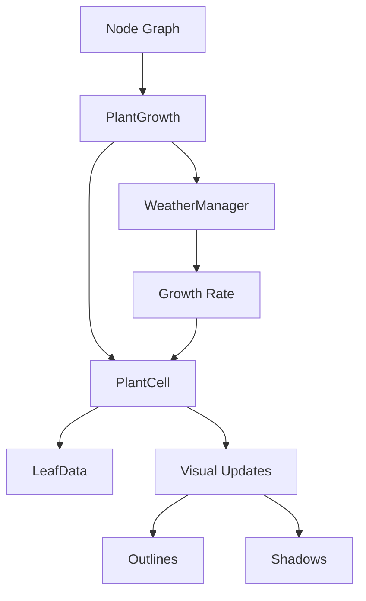
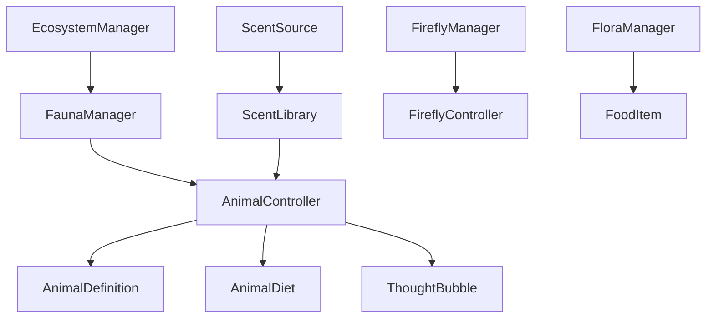
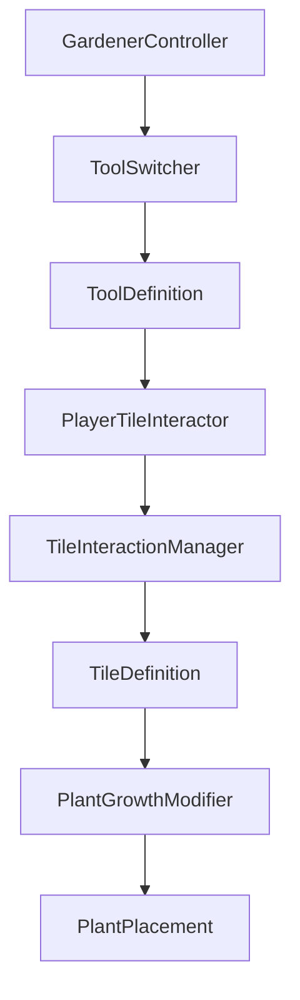

# Codebase Summary

**Last Updated:** 2025-05-29  
**Project Structure Version:** 1.0

## 📁 Folder Structure

### Assets/Scripts/
Core gameplay and system scripts organized by domain:

- **Battle/** - Plant growth, weather, and status effects
  - Plant/ - PlantGrowth system with cell-based architecture
  - Status Effects/ - Status effect system (e.g., burning)
  - SpellProjectile.cs - Projectile behavior

- **Ecosystem/** - Plant and animal simulation
  - Animals/ - Animal definitions and library
  - Core/ - Managers (Ecosystem, Fauna, Flora) and controllers
  - Effects/ - Environmental effects (e.g., Firefly system)
  - Food/ - Food types and animal diet system
  - Scents/ - Scent system definitions and library

- **Nodes/** - Node-based plant genetics system
  - Core/ - Node definitions, effects, and library
  - Runtime/ - Node execution and graph system
  - UI/ - Node editor interface and interactions

- **Player/** - Player controls
  - GardenerController.cs - Main player controller

- **Tiles/** - Tile system and ground mechanics
  - Data/ - Tile definitions, interactions, and placement
  - Editor/ - Custom editors for tile system
  - Tools/ - Tool system for ground modification

- **Visuals/** - Visual effects and post-processing
  - Night color post-processing
  - Plant outlines and shadows
  - Water reflections
  - Pixel perfect camera setup

### Assets/Editor/
Node system editor tools:

- **NodeDefinitionAutoAdder.cs** - Automated node setup
- **NodeDefinitionCreator.cs** - Node creation tools
- **NodeDefinitionEditor.cs** - Node property editor
- **NodeDefinitionLibraryEditor.cs** - Node library management
- **NodeDefinitionPostprocessor.cs** - Asset post-processing
- **NodeEffectDrawer.cs** - Visual effect property drawer

Additional editor tools are located within their respective systems (e.g., Tiles/Editor/)

### Assets/Scriptable Objects/
Data-driven configuration assets:

- **Animals/** - Animal behavior definitions
- **Animals Diet/** - Diet preferences and rules
- **Food/** - Food item properties
- **Life Thoughts/** - AI thought patterns
- **Nodes Plant/** - Plant genetics node definitions
- **Scents/** - Scent system configurations
- **Tiles/** - Tile type definitions
- **Tools/** - Tool behavior settings
- **Waves/** - Wave/pattern definitions

## 🔄 Data Flow

### Plant Growth System

### Ecosystem Simulation

### Tile Interaction

## 🔌 External Dependencies

### Core Dependencies
- Unity Universal RP
- New Input System
- TextMesh Pro

### Custom Packages
- DualGrid (com.skner.dualgrid)
- HueFolders

## 🏗️ Architecture

### Core Systems
1. **Node System**
   - Extensible node framework
   - Visual node editor
   - Runtime execution engine

2. **Ecosystem**
   - Decentralized AI
   - Event-driven interactions
   - State management

3. **Tile System**
   - Dual-grid implementation
   - Wang tile rules
   - Ground modification

## 🔄 Recent Changes

### Latest Updates
- Node system optimization
- Animal AI improvements
- Visual effect enhancements

### Structural Changes
- Modular script organization
- Enhanced editor tools
- Performance optimizations

## 📊 Performance Considerations

### Critical Paths
1. Node graph execution
2. Animal AI updates
3. Tile system modifications
4. Visual effect rendering

### Optimization Targets
- Batch plant updates
- Cache AI decisions
- Pool visual effects
- Minimize physics calls

## 🧪 Testing

### Test Coverage
- Editor tools: High
- Core systems: Medium
- Visual effects: Low

### Test Priorities
1. Node execution accuracy
2. AI behavior consistency
3. Tool interaction reliability
4. Performance benchmarks

## 📝 Documentation Files

### Core Documentation
- **projectRoadmap.md** - Project vision and milestones
- **currentTask.md** - Active development focus
- **techStack.md** - Technical configuration
- **codebaseSummary.md** - This file

### Additional References
- DualgridPackage_user-guide.md
- DualgridPackage_cheatsheet.md

## 🔍 Code Style

### Conventions
- PascalCase for types
- camelCase for fields/properties
- Regions for logical grouping
- XML documentation on public APIs

### Best Practices
- Single responsibility principle
- Event-driven communication
- Data-driven configuration
- Editor tool automation

---

**Next Update:** When making significant architectural changes or adding new systems
